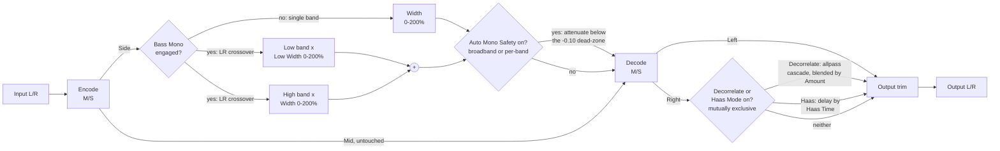

# Architecture

## Signal flow

`FirmamentEngine` (`src/dsp/FirmamentEngine.{h,cpp}`) owns the whole chain. `MidSideCodec` (`src/dsp/MidSideCodec.h`) is a small, stateless pair of encode/decode functions factored out so the core Mid/Side identity is directly unit-testable without any DSP state involved (`tests/MidSideCodecTests.cpp`).

v0.2.0 (`docs/design-brief.md`, a research-driven deep-dive rework) revised Auto Mono Safety's ballistics/dead-zone/floor and added an opt-in per-band (multiband) mode, added a second alternative widening technique (Decorrelate, mutually exclusive with Haas Mode), and widened Bass Mono Freq's range ceiling from 500 to 600 Hz - see the dedicated sections below for each. The v0.1/v0.1.1 signal path (Width/multiband width, the bass-mono crossover itself, Haas Mode's own algorithm) is otherwise unchanged; every new parameter defaults to a value that reproduces v0.1.1 behaviour exactly.

v0.3.0 (binding brief `.scaffold/research/2026-07-25-sota/brief-firmament.md`; math sources in `docs/research-notes.md` Section 9) adds velvet-noise decorrelation modes, a bass-mono mode selector (Classic / Phase Matched / Linear Phase - the codebase's first nonzero-latency path), 3-band width via a second high-split crossover, compressor-style Dynamic safety ballistics, opt-in equal-power width compensation, a Mono Audition monitor switch, Haas/toggle polish (Lagrange interpolation, per-sample delay smoothing, crossfaded enables), a per-band + output correlation meter surface, and state-schema versioning (`stateVersion = 2`). Every new parameter again defaults to exact v0.2.0 behaviour, verified bit-exactly by `tests/StateTests.cpp` - see "v0.3.0 additions" below.

## Module map

| Directory | Responsibility |
|---|---|
| `src/dsp` | All audio-thread DSP: `MidSideCodec` (stateless M = (L+R)/2, S = (L-R)/2 encode/decode) and `FirmamentEngine` (the full chain: multiband Width/Low Width, Auto Mono Safety broadband/multiband, output trim, Haas Mode, Decorrelate). No allocation, locks, or I/O once `prepare()` has run. Independent of `juce::AudioProcessor` so it is directly unit-testable (see `tests/EngineTests.cpp`, `tests/MidSideCodecTests.cpp`, `tests/GainStagingTests.cpp`, `tests/MultibandWidthTests.cpp`, `tests/AutoMonoSafetyTests.cpp`, `tests/CorrelationMeterTests.cpp`, `tests/HaasModeTests.cpp`, `tests/DecorrelateTests.cpp`). |
| `src/params` | Parameter layout and `AudioProcessorValueTreeState` definitions - parameter IDs, ranges, defaults. Single source of truth for what a preset captures. |
| `src/presets` | M2 preset system (`.scaffold/specs/preset-system-m2.md`, copied verbatim from `basilica-audio/nave`'s pilot implementation - see that repo's `docs/preset-system-notes.md` for the replication recipe): `PresetManager` (factory/user preset discovery, load/save/rename/delete, default resolution, import/export, dirty tracking) and `PresetBar` (the editor strip UI), plus `Localisation` (the German i18n frame). Fully generic - no Firmament-specific code beyond the small config surface `PluginProcessor.cpp`/`PluginEditor.cpp` pass in. |
| `src/PluginProcessor.*` | Host plumbing: APVTS construction, bus-layout negotiation (stereo out, mono-or-stereo in), `prepareToPlay`/`processBlock`/`reset`, dynamic latency reporting (0 for every minimum-phase path, N/2 while Linear Phase bass-mono is commanded - forwarded on the message thread via a 50 ms servicing timer, v0.3.0), state save/load with schema versioning, preset manager construction/startup-default resolution, and refreshing the correlation/output-meter atomics from the engine every block. Reads APVTS values and pushes them into `FirmamentEngine` every block; does not implement any DSP itself. |
| `src/PluginEditor.*` | A simple, functional v0.1/v0.2-style GUI: a preset bar strip docked at the top, one rotary slider per float parameter and one toggle button per bool parameter, bound via `SliderAttachment`/`ButtonAttachment`. A custom vector-drawn GUI and an actual correlation/phase meter *widget* (the underlying value is already computed - see below) are M3 scope. |

Dependency direction is one-way: `PluginEditor` -> `params` (via attachments) and `PluginProcessor` -> `params` + `dsp`. `src/dsp` has no upward dependency on the processor or UI, which is what keeps `FirmamentEngine` testable in isolation.

## Mid/Side width and the mono-compatibility invariant

`MidSideCodec::encode` computes `mid = (left + right) * 0.5` and `side = (left - right) * 0.5`; `decode` computes `left = mid + side`, `right = mid - side`. `FirmamentEngine::process()` only ever scales the *Side* channel - via Width, multiband Low Width/Width, and Auto Mono Safety, all described below - before decoding back to L/R; Mid is never touched by any of them.

This has a useful, load-bearing consequence: since decode is always `left + right == 2 * mid` **regardless of what Side is**, the mono downmix of Firmament's output is exactly identical to the mono downmix of its input at *any* Width/Low Width/Auto Mono Safety setting, including 0% (fully collapsed to mono) and 200% (maximally wide). Widening the stereo image can never change what a listener folding down to mono hears - `tests/EngineTests.cpp`'s "Mono downmix is unaffected by Width or bass-mono" test and `tests/MultibandWidthTests.cpp`'s/`tests/AutoMonoSafetyTests.cpp`'s equivalents verify this invariant end-to-end across a spread of settings, and `tests/MidSideCodecTests.cpp` verifies it at the stateless codec level directly.

**This invariant does not extend to Haas Mode** (see below) - Haas Mode operates after M/S decode and intentionally offsets Right in time relative to Left, which is incompatible with an exact `left + right == 2 * mid` guarantee by construction. It is off by default and clearly documented as a different, non-M/S widening technique.

At Width = 100% with the bass-mono stage off, scaling Side by exactly 1.0 makes the whole chain an identity transform, so the plugin nulls against its input - this is `tests/EngineTests.cpp`'s "unity M/S round-trip" test, to < -90 dBFS residual (matched to the specified tolerance rather than the tighter bound plain floating-point round-trip arithmetic would actually achieve, so the test stays meaningful if the tolerance is later relaxed for a different reason). `tests/SampleRateSweepTests.cpp` extends this same null test across the full 44.1-192 kHz range.

## Multiband width (Low Width / Width)

When the bass-mono crossover is engaged (`BassMonoFreq` > 0), the Side signal is split into a low and a high band by the crossover (see below), and each band is scaled by its own independent width control before being summed back together: `Low Width` (0-200%, default 0%) below the crossover frequency, `Width` (0-200%, default 100%) above it. With the crossover off, `Width` alone scales the whole (single-band) Side signal, exactly as in v0.1.

`Low Width`'s default of 0% exactly reproduces v0.1's original "bass mono forces the low band to silence" behaviour: scaling a filtered band by a constant commutes exactly with scaling-then-filtering (both linear operations), so discarding the low band entirely (v0.1) and multiplying it by 0 after extracting it (M1) are equivalent. This is a strict generalisation of the v0.1 feature, not a behaviour change, at the default setting - `tests/MultibandWidthTests.cpp`'s "Low Width 0% ... reproduces the v0.1 ... behaviour" test verifies this directly, and the original v0.1 bass-mono test (`tests/EngineTests.cpp`) continues to pass unmodified against the new engine.

At any other `Low Width`, or when both bands are re-summed with a nonzero gain (including `Low Width == Width == 100%`), the recombined Side is **not** a null/identity operation relative to the un-split signal - see "Bass-mono crossover" below for why, and `tests/MultibandWidthTests.cpp`'s "preserves signal magnitude (flat-magnitude allpass sum, not an exact null)" test for the documented, verified behaviour. This is standard, expected behaviour for any Linkwitz-Riley-crossover-based multiband processor, not a defect.

## Auto Mono Safety

A running, leaky-integrated (300 ms one-pole - v0.2.0, moved from 200 ms; see "v0.2.0 revisions" below) correlation estimate of the plugin's *input* L/R - computed every sample from `sum(L*R) / sqrt(sum(L*L) * sum(R*R))`, independent of whether the feature is engaged, so it is always current for `FirmamentEngine::getCorrelationValue()` (see "Correlation/phase meter" below) - drives an optional additional attenuation of the Side signal: full Side gain while the input's correlation sits inside the `[-0.10, 1.0]` dead-zone (v0.2.0), ramping linearly down toward a user-controlled floor gain (`autoMonoSafetyFloorDb`, default -9.1 dB) as correlation approaches -1 (fully out-of-phase). Off by default.

Because this only ever scales Side and never touches Mid, it can never break the `left + right == 2 * mid` mono-sum invariant above, regardless of how aggressively it reacts, in both its broadband and multiband forms - `tests/AutoMonoSafetyTests.cpp`'s "never breaks the mono-sum invariant" test verifies this directly with a strongly anti-phase input.

Deriving the estimate from the plugin's raw input (rather than its Width-scaled output) keeps it a direct read of the source material's own mono-compatibility risk and avoids a feedback loop with the very Side scaling it drives.

### v0.2.0 revisions (docs/design-brief.md): ballistics, dead-zone, floor, multiband

Research-driven (see `docs/research-notes.md` Sections 5-6), all four changes default to reproducing v0.1.1 behaviour exactly:

- **Ballistics**: `correlationTimeConstantSeconds` moved from 200 ms to 300 ms - a reasoned compromise toward, not all the way to, the ~600 ms documented for a pure *display* correlation meter (Auto Mono Safety is a live control-loop input as well as a future meter feed). `tests/AutoMonoSafetyTests.cpp`'s ballistics test measures the estimate's settling time directly and asserts it reflects 300 ms, not 200 ms.
- **Dead-zone**: correlation in `[-0.10, 1.0]` now yields full (1.0) safety gain, not just `correlation >= 0.0` - "the occasional small deviation into the negative side is usually insignificant" (documented correlation-meter practice). `tests/AutoMonoSafetyTests.cpp`'s dead-zone test verifies bypass-identical gain inside the zone and measurable attenuation just below it.
- **Floor**: the previously-hardcoded 0.35 linear floor gain is now the `autoMonoSafetyFloorDb` parameter (-24 to 0 dB, default -9.1 dB - `Decibels::decibelsToGain(-9.1) ≈ 0.35`, reproducing the old default). `tests/AutoMonoSafetyTests.cpp`'s floor test sweeps the full range at correlation == -1.0 and checks the measured gain against the corresponding linear value at every point.
- **Multiband** (`autoMonoSafetyMultiband`, bool, default off): when on *and* Bass Mono Freq is engaged, a second pair of mono `LinkwitzRileyFilter`s (`leftMultibandCrossover`/`rightMultibandCrossover`, run on the raw input L/R at the same crossover frequency as the bass-mono crossover, always processing regardless of enablement - the same "always process, conditionally use" discipline as the crossover itself) drives two independent leaky-integrated correlation estimates, one per band. Each band's own correlation-derived safety gain is applied to its own Side content *before* the low/high recombination, instead of one broadband estimate scaling both. When Bass Mono Freq is off, or Multiband itself is off, behaviour is unchanged (single broadband estimate). `tests/AutoMonoSafetyTests.cpp`'s multiband test feeds a signal that is out-of-phase only above the crossover and confirms the low band's gain stays near 1.0 while the high band's drops toward the floor with Multiband on - and, as a regression guard, confirms the same signal with Multiband *off* pulls both bands down together via the single broadband estimate.

## Correlation/phase meter

`FirmamentEngine::getCorrelationValue()` exposes the same running correlation estimate that drives Auto Mono Safety (see above), in `[-1, 1]` (`1` = perfectly in-phase, `0` = uncorrelated, `-1` = perfectly out-of-phase), updated once per `process()` call. `FirmamentAudioProcessor::getCorrelationMeterValue()` refreshes an atomic from it at the end of every `processBlock()`, safe to read from any thread. `tests/CorrelationMeterTests.cpp` verifies the estimate converges toward +1/-1 for in-phase/anti-phase signals, stays finite for silence, and stays within `[-1, 1]` across a randomised sweep.

This is DSP-complete but **not yet wired to a GUI meter widget** - the v0.1-style editor (`src/PluginEditor.*`) does not display it. Building an actual meter component is explicitly M3 scope (GitHub issue "Custom GUI / LookAndFeel": *"Add metering where relevant to the plugin"*), not M1.

## Haas Mode

An alternative, non-M/S widening technique, applied *after* M/S decode: when engaged, the Right channel is delayed by `Haas Time` (0-40 ms, default 20 ms) relative to Left via a `juce::dsp::DelayLine<float, DelayLineInterpolationTypes::Linear>`, trading the M/S width-scaling model's exact mono-sum guarantee for a stronger, well-known psychoacoustic widening effect (the precedence effect). Off by default, and orthogonal to Width/multiband width/Auto Mono Safety, which all operate purely in the M/S domain before Haas Mode's post-decode delay is applied.

The delay line is always pushed/popped every sample, even while Haas Mode is off (with the delay pinned to 0 samples, which - by construction of the delay line's lockstep read/write pointers - is an exact passthrough), so enabling it mid-stream never starts from stale/discontinuous buffered history. `tests/HaasModeTests.cpp`'s "off (default) is a fully transparent passthrough" test verifies this against the same -90 dBFS bound as the v0.1 unity round-trip test, and its "delays Right by the configured time in samples" test verifies the delay mechanism directly with an impulse.

Haas Mode's delay is an intentional *relative* channel-to-channel offset - the whole point of the effect - not a processing artifact a host needs to compensate for (the same way a chorus/flanger's internal modulated delay is not reported as plugin latency either), so it is never reported via `getLatencySamples()`.

**v0.2.0 mutual exclusivity with Decorrelate (see below)**: whenever `decorrelateEnabled` is on, the delay line's target delay is pinned to 0 samples every block regardless of `haasEnabled`'s own state - Decorrelate takes effect instead. `tests/DecorrelateTests.cpp`'s mutual-exclusivity test asserts the two-enabled-at-once output matches Decorrelate-only processing bit-exactly.

## Decorrelate (v0.2.0)

A second alternative, non-M/S widening technique, applied *after* M/S decode alongside Haas Mode (mutually exclusive with it - see above): a cascade of four fixed-frequency allpass IIR filters (`juce::dsp::IIR::Filter<float>`, coefficients from `IIR::Coefficients<float>::makeAllPass(sampleRate, frequency, Q)` at 300/900/2700/8100 Hz, `Q = 0.7`) processes the decoded Right channel, and the output blends between the dry signal and the fully-allpass-filtered signal by `decorrelateAmount` (0-100%, default 50%). Off by default (`decorrelateEnabled`).

Where Haas Mode trades the exact mono-sum guarantee for a strong precedence-effect delay (deep, periodic comb-filter notches on mono fold-down - see `docs/research-notes.md` Section 4), Decorrelate trades a much smaller, documented cost: an allpass network preserves the magnitude spectrum exactly per-stage (`|H(f)| = 1`), so the mono-fold-down deviation it introduces is bounded, mild spectral ripple rather than deep nulls. `tests/DecorrelateTests.cpp`'s mono-fold-down test measures this directly via a real magnitude-spectrum comparison (`juce::dsp::FFT`, Hann-windowed, peak per-bin dB deviation against the pre-processing reference spectrum) and confirms Decorrelate's peak deviation is both small in absolute terms and markedly smaller than Haas Mode's on identical broadband-noise input.

Like the bass-mono crossover and Haas Mode's delay line, the allpass cascade always processes every sample - even while Decorrelate is disabled - so its internal state never goes stale when re-enabled; only the dry/wet blend is conditional. `tests/DecorrelateTests.cpp`'s "off (default) is a fully transparent passthrough" test verifies this against the same -90 dBFS bound as the equivalent Haas Mode/unity-round-trip tests.

Each allpass stage is a direct-form biquad (`juce::dsp::IIR::Filter`, transposed Direct Form II) - zero-latency and sample-synchronous, like the bass-mono crossover - so Decorrelate never adds to `getLatencySamples()`; `tests/LatencyTests.cpp` has a dedicated test asserting this explicitly with Decorrelate engaged (including alongside Multiband and a mutual-exclusivity Haas Mode toggle).

**Honesty note** (`docs/design-brief.md`): Decorrelate is presented in the manual as "gentler, more mono-tolerant", not "mono-safe" - it remains, like Haas Mode, an explicit, documented exception to the mono-sum invariant, just a smaller one. The exact allpass topology (stage count, frequency spacing, Q) is implementation-reasoned - no source publishes an exact filter design for this category of effect, only the *principle* (spread, irregular phase shift beats a single time offset for mono-fold-down cost) and the *comparative magnitude* (mild ripple vs. deep comb notches), both directly sourced.

## Bass-mono crossover

The bass-mono stage is implemented with a single `juce::dsp::LinkwitzRileyFilter<float>` (JUCE 8.0.14, `juce_dsp/processors/juce_LinkwitzRileyFilter.h`), prepared with `numChannels = 1` since it operates on just the one derived Side stream rather than the stereo bus, and reused for both the original v0.1 "force to mono below the crossover" behaviour and the M1 multiband-width split (see above) - both are the same underlying dual-output `processSample(channel, input, outputLow, outputHigh)` call. v0.2.0's multiband Auto Mono Safety adds a second pair of identically-configured mono crossovers run on the raw input L/R (see "Auto Mono Safety" above) - all three crossovers are kept at the same live-tracked frequency.

**v0.2.0 range extension**: `Bass Mono Freq`'s range ceiling moved from 500 to 600 Hz (skew unchanged at 0.4) - `docs/design-brief.md`'s single lowest-confidence, most-reasoned change, based on the Waves S1 Shuffle control's documented ~600 Hz convention (an indirect, third-party-summarised source, not a primary manual). `ParameterIds.h`'s frozen-ID rule explicitly permits range/skew tuning pre-1.0; only the ID itself (`bassMonoFreq`) is frozen. `tests/MultibandWidthTests.cpp`'s range-extension test re-runs the forced-mono-below-crossover and magnitude-preservation guarantees parametrised across `{80, 150, 300, 450, 500, 600}` Hz, not just the old 0-500 Hz span.

**On the sum of its two outputs:** per JUCE's own class documentation, *"Linkwitz-Riley filters are widely used in audio crossovers that have two outputs, a low-pass and a high-pass, such that their sum is equivalent to an all-pass filter with a flat magnitude frequency response."* In other words, `outputLow + outputHigh` preserves the input's magnitude but **not** its phase/sample-domain identity - confirmed empirically during development (summing the two unscaled bands reproduces the input's RMS level closely but not its individual sample values). This is why v0.1's original bass-mono feature only ever *discards* the low band and keeps the high band alone rather than re-summing anything: a highpass filter's output is genuinely close to zero below its own cutoff on its own, a property that does not depend on any sum-identity claim. `tests/EngineTests.cpp`'s "Bass-mono forces the Side channel to (near) zero" test verifies exactly that in isolation, and `tests/MultibandWidthTests.cpp`'s "preserves signal magnitude" test verifies the flat-*magnitude* half of the documented guarantee directly when both bands are re-summed for multiband width.

This filter uses a TPT (topology-preserving transform) structure and, unlike an FIR crossover or an oversampled nonlinearity, **introduces no reported or oversampling-style latency at all** - it is a direct-form IIR filter, sample-synchronous by construction. Since v0.3.0 `FirmamentEngine::getLatencySamples()` is *dynamic* rather than a `static constexpr 0`: it still returns exactly 0 for the Classic and Phase Matched bass-mono modes (and everywhere else in the chain), and returns N/2 samples only while the Linear Phase bass-mono mode is commanded (see "v0.3.0 additions" below). `tests/LatencyTests.cpp` asserts both halves across sample rates, block sizes, and bass-mono settings.

0 Hz is a frozen "off" sentinel (see `ParameterIds.h`): `setBassMonoFrequencyHz(0.0f)` is never forwarded to the crossover's frequency smoother's *target* (which requires a strictly positive, sub-Nyquist cutoff - JUCE 8.0.14 asserts `isPositiveAndBelow(cutoff, sampleRate * 0.5)`); instead `process()` gates only which *output* is used - the low/high split (multiband) vs. the Width-scaled Side channel straight through (single-band) - on `lastBassMonoHz > 0.0f`. The crossover itself is always run against the live Side signal, even while disabled, the same "always process, conditionally use" pattern the Haas Mode delay line below already follows: `LinkwitzRileyFilter::processSample()`'s internal TPT state (s1-s4) is otherwise only mutated when called, so gating the call itself (rather than just its output) left that state frozen at whatever it held when the section was last engaged - not decayed or reset - producing an audible transient on re-engagement (e.g. `BassMonoFreq` automation sweeping back up through 0 Hz). Fixed for v0.1.1; see `tests/MultibandWidthTests.cpp`'s "re-engaging after a disabled stretch resumes from live filter state" test.

## Mono input handling

Firmament fundamentally needs two channels to do anything meaningful (Mid/Side encoding is undefined for a single channel), but `isBusesLayoutSupported()` still accepts a mono *input* bus paired with the (always-required) stereo output bus, since some hosts route a mono source into a stereo effect chain. `PluginProcessor::processBlock()` duplicates the single input channel into the second channel before handing the buffer to the engine - this makes the encoded Side channel exactly 0 (rather than clearing it, which would instead make Side equal to half the mono signal, an unintended hard-panned artifact), so a mono source degrades gracefully to an unwidened mono pass-through regardless of the Width setting (`tests/RobustnessTests.cpp`'s and `tests/BusConfigTests.cpp`'s mono-input-bus tests). `tests/BusConfigTests.cpp` also directly exercises `isBusesLayoutSupported()`'s accepted and rejected configurations (mono/stereo in, stereo out only, surround and mono-out rejections).

## Real-time safety

- `FirmamentAudioProcessor::processBlock()` starts with `juce::ScopedNoDenormals`.
- All DSP state (the crossover's filter state, the Haas Mode delay line, the output gain ramp) is allocated in `prepare()`/`prepareToPlay()` and never reallocated on the audio thread.
- `reset()` clears crossover/gain/delay-line/correlation state without deallocating (`FirmamentEngine::reset()`, called from both `AudioProcessor::reset()` and internally from `prepare()`).
- Parameter values are read via `apvts.getRawParameterValue()` atomics in `processBlock()`, never via `apvts.getParameter()->getValue()` and never via `String`-keyed lookups on the audio thread; the two new bool parameters (Auto Mono Safety, Haas Mode) are read the same way and thresholded at `> 0.5f`.
- `FirmamentEngine::process()` treats a zero-sample or non-stereo block as a safe no-op before touching any filter/gain/delay state.
- Every input sample is scrubbed for NaN/Inf (replaced with 0.0f) before it reaches the Mid/Side encode, the crossover, or the correlation estimator: unlike a purely feedforward gain stage, the crossover's IIR state (and the correlation estimator's leaky integrators) carry a poisoned value forward indefinitely once it gets in, so a single corrupted host sample would otherwise permanently contaminate every subsequent block rather than being contained to the one bad block (`tests/RobustnessTests.cpp`'s NaN/Inf sweep test).
- The bass-mono crossover frequency is clamped strictly positive and below Nyquist (`clampBelowNyquist`, in `FirmamentEngine.cpp`) before being passed to `setCutoffFrequency()`, as defensive insurance against invalid coefficients if the plugin is ever prepared at an unusually low sample rate. The Haas Mode delay time is likewise clamped to `[0, haasDelayLine.getMaximumDelayInSamples()]` before being passed to `DelayLine::setDelay()`.

## Parameter smoothing

- **Width** and **Low Width** are plain multiplicative scales on their respective Side bands with no coefficients to recompute, so both are smoothed linearly and interpolated per-sample via `SmoothedValue::getNextValue()`.
- **Bass Mono Freq** recomputes `LinkwitzRileyFilter` coefficients (a `tan()` call) on change, so - like Overture's Tight/Tone filters - it is smoothed multiplicatively (appropriate for a quantity perceived logarithmically) but re-derived once per block via `skip()` rather than per sample.
- **Haas Time** is likewise re-derived once per block via `skip()` rather than per sample - there is no audible benefit to sample-accurate updates for a manually-set widening parameter, and `DelayLine::setDelay()` is cheap regardless.
- **Haas Mode** (bool parameter) is read once per block as an instant on/off gate - its delay line is always pushed/popped regardless (pinned to 0 samples while off), so the gate itself introduces no discontinuity; no separate smoothing is needed.
- **Auto Mono Safety** (bool parameter) crossfades between fully bypassed and fully engaged via a dedicated linearly-smoothed 0..1 amount (`autoMonoSafetyAmountSmoothed`, same `smoothingTimeSeconds` as Width/Low Width), rather than being read as an instant per-block gate. The correlation-derived safety gain is always computed (the correlation sums already run unconditionally - see above) and blended between 1.0 (bypass) and that gain by the smoothed amount. This was originally an instant gate like Haas Mode, but because the correlation estimate keeps running while the feature is nominally off, the derived gain can already be sitting at its ~0.35 floor (~-9 dB) the instant the toggle is flipped on - stepping Side gain by up to ~9 dB in a single sample. Fixed for v0.1.1; see `tests/AutoMonoSafetyTests.cpp`'s "toggle ramps the Side gain smoothly instead of stepping" test.
- **Output** is a plain gain stage (`juce::dsp::Gain<float>`), which ramps sample-accurately via its own internal `SmoothedValue` (`setRampDurationSeconds`).
- **Auto Mono Safety Floor** (v0.2.0) is converted to linear gain (`Decibels::decibelsToGain`) and smoothed linearly per-sample, the same scheme as Width/Low Width.
- **Auto Mono Safety Multiband** (v0.2.0, bool parameter) is read once per block as an instant gate, like Haas Mode - the per-band correlation sums/crossovers it switches between using are always running (see "Auto Mono Safety" above), so the gate itself introduces no discontinuity.
- **Decorrelate Amount** (v0.2.0) is smoothed linearly per-sample, the same scheme as Width/Low Width; **Decorrelate** itself (bool parameter) is read once per block as an instant gate, like Haas Mode - see "Decorrelate" above for why this doesn't need Auto Mono Safety's crossfaded-toggle treatment.
- **v0.3.0 revisions/additions**: **Haas Time** is now applied per-sample (see "Haas & toggle polish" above); **Haas Mode** and **Decorrelate** enables are now 50 ms crossfades rather than instant gates; **Decorrelate Mode**, **Bass Mono Mode** (Classic <-> Phase Matched) and **Safety Response** crossfade their always-running paths over 50 ms; **High Split** follows Bass Mono Freq's multiplicative-smoothing + once-per-block recompute scheme; **High Width** and the **Width Compensation** makeup gain follow Width's linear per-sample scheme; **Mono Audition** is a 50 ms crossfade. Transitions to/from **Linear Phase** use a dedicated ~5 ms mute-fade instead (see "v0.3.0 additions").
- All smoothers are seeded to their real starting value in `FirmamentEngine::prepare()`, so re-preparing (sample-rate change, etc.) never resets a live parameter back to a built-in default or lets the frequency/delay smoothers start from an invalid value.

## v0.3.0 additions

Binding brief: `.scaffold/research/2026-07-25-sota/brief-firmament.md` (including its Revision notes). Full literature citations: `docs/research-notes.md` Section 9. All eight features follow the suite's "always process, conditionally use" discipline; every settled crossfade weight is exactly 0 or 1 and selected bit-exactly (`blendSelect()` in `FirmamentEngine.cpp`), which is what keeps the neutral-default render bit-identical to v0.2.0 (`tests/StateTests.cpp`, tolerance 0 same-binary).

### Velvet-noise decorrelation (Decorrelate Mode: Classic / Velvet Dense / Velvet Sparse)

`src/dsp/VelvetDecorrelator.h` implements the published optimized velvet-noise decorrelator pairs from Schlecht/Alary/Välimäki/Habets (DAFx-18) - OVN30 ("Velvet Dense", 30 taps, ~28 ms) and OVN15 ("Velvet Sparse", 15 taps, half the cost) - as sparse FIRs over a power-of-two circular buffer (~30/15 MACs per sample per channel, zero latency, no denormal tail). The coefficients are data transcribed from the open-access paper's Tables 1-2; no third-party code is copied. Published tap times are @44.1 kHz; `prepare()` rescales `k_i = round(tau_i * fs / 44100)` (ms-true timing; the paper documents < 1.3 dB smoothed-magnitude cost for integer rounding) and renormalises each filter to exactly unit energy.

**Mono-safe projection (deliberate, documented deviation from the brief's raw topology).** The brief specifies the raw symmetric complementary wet mix `L' = (1-d)L + d*VND_A(L)`, `R' = (1-d)R + d*VND_B(R)` *and* binds a mono fold-down dip of <= 3 dB at 100% amount. Those two requirements are physically incompatible: in M/S terms the raw topology gives `M'' = (1-d)M + d*(A+B)/2`, and the published OVN30 pair *sum* `A+B` carries a real ~17 dB third-octave notch (~320 Hz at 48 kHz - directly computable from the published coefficients; the DAFx-18 optimization constrains per-filter flatness and pair *coherence*, not the pair *sum*). Firmament resolves the conflict by keeping the widening half of the topology bit-for-bit - `S' = (1-d)S + d*(VND_A(L) - VND_B(R))/2` - and pinning `M' = M` (dry). Equivalently, per channel: `v = (VND_A(L) - VND_B(R))/2 - S; L' = L + d*v; R' = R - d*v`. Consequences:

- Every velvet setting is **mono-sum invariant by construction** (the money test measures a fold-down dip of ~0.0000003 dB, vs. 16.2 dB for the unguarded Haas control on the same program - `tests/DecorrelateTests.cpp`).
- Both channels are genuinely processed (symmetric widening cost; the centre image stays put), unlike the R-only Classic cascade.
- Classic mode (the v0.2.0 R-only allpass cascade) remains bit-exact and remains a *documented exception* to the mono-sum invariant; the velvet modes are not exceptions.

Mode switching crossfades three always-running paths over 50 ms; the master Decorrelate enable is likewise a smoothed 0..1 gain since v0.3.0 (it was an instant per-block gate in v0.2.0). Mutual exclusivity with Haas Mode is unchanged (Decorrelate wins; the Haas delay is pinned to 0). `tests/VelvetDecorrelatorTests.cpp` asserts per-filter third-octave flatness (<= 3 dB, measured 0.7-2.7 dB across 44.1/48/96/192 kHz), exact unit energy (|sum(g^2) - 1| < 1e-6), inter-channel coherence (frequency-mean absolute coherence over 30 third-octave bands <= 0.3) and broadband zero-lag correlation (measured ~0.20 for OVN30; the OVN15 pair's published coefficients measure ~0.30, so its bound is 0.35 - documented deviation from the brief's uniform 0.25, inherent to the published table, matching the paper's own "slightly higher coherence" caveat for OVN15).

### Bass-mono mode selector (Classic / Phase Matched / Linear Phase)

Active only while `bassMonoFreq > 0`; `bassMonoMode` defaults to Classic, which is the bit-exact v0.2.0 path (LR4 split on Side, Mid untouched - no changes whatsoever).

**Phase Matched** passes Mid through the companion 2nd-order allpass `AP2(fc, Q = 1/sqrt(2))` whose phase tracks the LR4 sections exactly, making the low/high recombination seam-free. `src/dsp/PhaseMatchedAllpass.h` wraps `juce::dsp::LinkwitzRileyFilter` in its documented `allpass` mode rather than hand-rolling a TPT AP2: JUCE's allpass type computes the LR4 low+high sum from the *identical* TPT state equations and tan()-prewarped coefficients as the crossover itself, so the binding "same prewarped omega0, same once-per-block recompute, same smoothed fc snapshot" constraint holds by construction. `tests/BassMonoPhaseTests.cpp` measures per-channel magnitude flat within +/-0.1 dB (measured 0.000003 dB band-sum deviation) and `angle(HP4) - angle(AP2)` <= 1 degree at every bin (measured ~5e-6 deg), with a unity-Mid negative control that must fail (measured 179.8 deg) to guard against silent regressions.

**Linear Phase** replaces the Side split with an FIR complementary pair: `S_low = FIR_LP(S)`, `S_high = delay(S, N/2) - S_low` (perfect reconstruction by construction), Mid delayed by the same N/2. `src/dsp/LinearPhaseCrossover.{h,cpp}`: Kaiser-windowed sinc lowpass, beta = 9, N = 4096 * fs / 48000 rounded to even; convolved with `juce::dsp::Convolution` (uniform partitioned) on the mono Side stream only. `juce::dsp::FIR::Filter` is explicitly rejected for this stage (its `ReferenceCountedObjectPtr` coefficients cannot be reassigned from the message thread while the audio thread dereferences them). Kernel handoff is ONE mechanism: recompute on the message thread (synchronously in `prepare()`; coalesced to one recompute per 50 ms on fc changes, serviced by the processor's timer) and install via `Convolution::loadImpulseResponse`, which copies the buffer and swaps through its internal background loader with a built-in output crossfade - no external double buffer, no atomic index flip. A `kernelEpoch()` counter is the deterministic ready signal for tests (the Catch2 harness runs no dispatch loop, so tests service updates directly and poll the epoch with a bounded timeout - see `TestHelpers.h`). Measured: perfect-reconstruction null at unity widths ~7e-9 peak residual (well under the -120 dBFS bound), side energy below 0.5*fc attenuated 96 dB with Low Width 0, group delay constant within 0.0002 samples.

**Latency**: N/2 samples (2048 at 48 kHz), the codebase's first nonzero latency. `FirmamentEngine::getLatencySamples()` is dynamic; the processor forwards changes via `setLatencySamples` from a 50 ms message-thread servicing timer (never from the audio thread). Any change to/from Linear Phase runs a short (~5 ms) mute-crossfade around the path swap - a click-free transition is impossible across a latency change anyway (hosts renegotiate PDC); documented in the manual. `tests/LatencyTests.cpp` asserts 0 for Classic/Phase Matched and exactly N/2 for Linear Phase, matching the measured impulse peak offset within +/-1 sample, at 44.1/48/96/192 kHz.

### 3-band width (High Split / High Width)

A second mono LR4 on the Side branch above the bass-mono split: Side -> [LR4 @ bassMonoFreq] -> low (Low Width) + rest -> [LR4 @ highSplitFreq] -> mid (Width) + high (High Width). Flat-sum discipline: the low band passes AP2(highSplitFreq) before the band sum so all three bands carry identical phase at the second crossover (standard 3-way Linkwitz-Riley practice); in Phase Matched mode Mid gets AP2(bassMonoFreq) * AP2(highSplitFreq). `highSplitFreq = 0` is the off sentinel (mirroring `bassMonoFreq`); the internal clamp keeps `highSplitFreq >= 2 * bassMonoFreq` while both are engaged. With the sentinel at 0 the band-sum path is bit-identical to the two-band expressions (`tests/MultibandWidthTests.cpp`, tolerance 0 against the same-binary neutral render; <= -140 dBFS against the frozen v0.2.0 reference). Engaged at unity widths, the 3-band sum is magnitude-flat within +/-0.1 dB.

### Dynamic safety ballistics (Safety Response: Smooth / Dynamic)

Smooth is the bit-exact v0.2.0 static map on the 300 ms estimate. Dynamic drives the *same* static map (dead-zone >= -0.10 -> 1.0, linear ramp to the user floor at -1.0) from a second, fast (tau = 30 ms) correlation estimator set, and passes the resulting gain through a dedicated asymmetric one-pole - NOT a `juce::SmoothedValue`. Ballistics convention (binding): attack 5 ms / release 250 ms are times to **90% settling** toward the target, so the internal time constants are `t90 / ln(10)` (~2.17 ms / ~108.6 ms) with `a = 1 - e^(-1/(tau*fs))`. The multiband variant runs per-band fast estimators with the same ballistics. Because reducing Side monotonically raises the output correlation for fixed program material, the loop cannot oscillate. `tests/AutoMonoSafetyTests.cpp` measures 90% attack within 15 ms of an anti-phase burst and 90% release within 280 ms +/-30% after correlated program returns.

**Energy-gate decay rule (binding for every correlation estimator in the plugin - display meters and guard detectors alike):** below an energy gate (both channels around -60 dBFS RMS), each gated estimate decays toward 0 instead of holding its last ratio. A leaky Pearson ratio is invariant under silence (numerator and denominator decay at the same rate), so without the gate the display would show +/-1 on silence (beis.de rule) and the Dynamic guard would latch rho = -1 after an anti-phase burst into silence and never release. The *Smooth control path* deliberately keeps the raw v0.2.0 ungated ratio (bit-identical legacy behaviour); the gate applies to the displayed meter values and the Dynamic path's fast detectors. `tests/AutoMonoSafetyTests.cpp` has a dedicated release-into-true-silence test.

### Equal-power width compensation (`widthComp`, opt-in)

With `a = (1+w)/2`, `b = (1-w)/2` (w = width/100), a post-decode makeup `g = 1/sqrt(a^2 + b^2)` (exactly 1 at w = 1) keeps perceived level constant across the Width range for decorrelated material. Computed from the broadband `width` parameter only (documented multiband limitation - Low/High Width do not enter the formula); smoothed with the standard 50 ms `SmoothedValue`; off by default (the mastering convention "width changes side level only" stays the default). `tests/GainStagingTests.cpp` verifies RMS within +/-0.5 dB across width 0-200% on an exactly-decorrelated pink program, and that the off state reproduces the uncompensated curve (`sqrt(a^2+b^2)`) exactly.

### Mono Audition (`monoAudition`)

Post-everything (after the output trim): `L = R = (L+R)/2`, crossfaded over 50 ms like every other toggle. A monitor control (excluded from factory presets), deliberately NOT part of the mono-sum invariant tests - it *is* the fold-down.

### Haas & toggle polish

- `juce::dsp::DelayLine` interpolation moved `Linear` -> `Lagrange3rd`: fractional-delay HF response improves; integer-sample delays (including the 20 ms default at 48 kHz = 960 samples, and the pinned 0) are bit-exact as before.
- Delay-time application moved from once-per-block `setDelay()` steps to per-sample smoothed updates (the existing `SmoothedValue` feeds `setDelay` every sample; Lagrange interpolation makes this artifact-free) - kills the automation pitch-zipper.
- `haasEnabled` moved from an instant per-block gate to a smoothed 0..1 crossfade, mirroring the safety-toggle discipline (as did `decorrelateEnabled` - see above).

### Meter surface

Per-band *input* correlation (low / above-bass-mono, v0.2.0; plus the mid/top bands of the high split, v0.3.0) and a new broadband *output* (post-processing) correlation (same 300 ms estimator on the final L'/R') are exported as `std::atomic<float>` snapshots written once per block (`FirmamentAudioProcessor::getCorrelationMeter*` accessors). All obey the energy-gate decay rule above. Consumed by the M3 GUI later; asserted by `tests/CorrelationMeterTests.cpp` now (identity/anti-phase/independent-noise/beis.de-trap/silent-channel cases).

### State-schema versioning & migration

`getStateInformation` stamps the APVTS root with `stateVersion = 2`; absent (v0.1.x/v0.2.0 states) means version 1. Version-1 states load tolerantly - every new v0.3.0 parameter stays at its neutral default - so the neutral-default design *is* the migration. `tests/StateTests.cpp` loads a frozen, checked-in v0.2.0 state fixture (`tests/fixtures/`, generated once from the actual v0.2.0 sources and never regenerated) and asserts: (a) tolerance-0 bit-exact null against a same-binary render with programmatically set v0.2.0-equivalent parameters, and (b) <= -140 dBFS peak residual against the frozen v0.2.0 reference render (tolerance 0 against a frozen file cannot hold across CI platforms - libm ULP drift through IIR feedback). Re-save reports version 2.

### Real-time-safety additions

`tests/AllocationGuardTests.cpp` (new - ported from the suite's AllocationGuard pattern) overrides global `operator new` with a *thread-local* counter and asserts zero heap allocations on the render-calling thread under every decorrelate/bass-mono/safety mode combination, including mode switches (and the Linear Phase path swap + reset) inside the guarded region, plus the 16384-sample oversized-block chunk guard through a 512-prepared engine. Message-thread work (kernel recomputes, `loadImpulseResponse`, timer posts) legitimately allocates on other threads and is exempt by construction of the thread-local scope.

## Preset system & i18n frame (v0.2.0)

`src/presets/` implements the suite-wide M2 preset system (`.scaffold/specs/preset-system-m2.md`), copied verbatim from `basilica-audio/nave`'s pilot implementation (see that repo's `docs/preset-system-notes.md` for the exact replication recipe and real-time-safety rationale). `PresetManager` owns factory preset discovery (`presets/factory/*.json`, embedded via `juce_add_binary_data` as `FirmamentBinaryData`), user preset discovery/CRUD (`~/Library/Audio/Presets/Yves Vogl/Firmament/` on macOS), default resolution, and import/export (single files and zip banks); `PresetBar` is the editor strip UI. Thirteen factory presets ship (see `docs/presets.md`) - the ten frozen v0.2.0 presets (nine sourced from `docs/design-brief.md`'s "Factory Presets" section plus a `Default`/`Init` passthrough preset, never edited since) plus three additive v0.3.0 presets exercising the new features (`Velvet Width`, `Mastering: Linear Phase Bass Mono`, `Three-Band Imager`).

`Localisation.{h,cpp}` installs `resources/i18n/de.txt` (also copied verbatim from `nave`) as the current `juce::LocalisedStrings` mapping when `SystemStats::getUserLanguage()` starts with `"de"`, selected once at editor construction. Only `PresetBar`'s frame strings (button labels, menu items, dialog text) are wrapped in `TRANS()`/translated - parameter names and units (`Width`, `Bass Mono Freq`, `dB`, `%`, ...) are never translated anywhere in this plugin, verified directly by `tests/LocalisationTests.cpp`.

`PresetManager`'s only audio-thread-adjacent code is its `AudioProcessorValueTreeState::Listener::parameterChanged()` override (dirty-flag tracking), implemented as a single lock-free `std::atomic<bool>` store; every other method does file I/O/JSON parsing/`juce::String` allocation and is called only from the message thread (constructor, `PresetBar`'s UI callbacks) - never from `processBlock()`.
